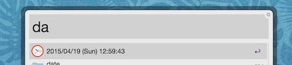

# About

This is a sample project of python-alfred-workflows. This workflows plugin display current datetime by inputting the keyword 'da' in Alfred.



# How To Build

```sh
$ mkvirtualenv dev
(dev)$ pip install shovel
(dev)$ shovel setup.develop   # install python-alfred-workflows
(dev)$ shovel make.workflows  # create workflows plugin
```

# Special Thanks
* [Clock, time icon](https://www.iconfinder.com/icons/196751/clock_time_icon#size=128)
